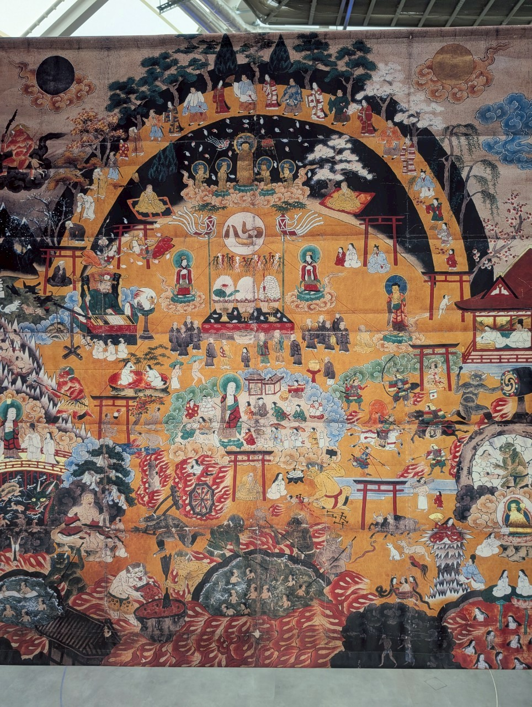

# 目次

- [目次](#目次)
  - [めっちゃ混んでた…](#めっちゃ混んでた)
  - [バビリオン](#バビリオン)
    - [UAEバビリオン](#uaeバビリオン)
    - [ブラジルバビリオン](#ブラジルバビリオン)
    - [トルクメニスタンバビリオン](#トルクメニスタンバビリオン)
    - [ポーランドバビリオンのレストラン](#ポーランドバビリオンのレストラン)
    - [アゼルバイジャンバビリオン](#アゼルバイジャンバビリオン)
    - [夜の地球](#夜の地球)
    - [トルコバビリオン](#トルコバビリオン)
    - [関西バビリオン](#関西バビリオン)
    - [スペインバビリオン](#スペインバビリオン)
  - [その他のショット](#その他のショット)
  - [まとめ](#まとめ)

## めっちゃ混んでた…

どうもZe;roPです!  
平日の木曜に行ったのですが、めっちゃ混んでたのと、台風が関西に突入したので雨の中での参加となりました笑  

中々でしたが、むしろ晴天よりも空いてたのかもしれないですね～おかげで、色々回れました!  

<b>圧巻!!!!</b>

色々とやかく言われていましたが、改めて見るとそんなのどうでもよくなるくらいいいもので、清水寺みたいだなぁって思ったら、どうやら清水寺の建築手法とのことでびっくりしました。。。  

次は全部は紹介しきれないですが、行ったバビリオンの紹介をします!

## バビリオン

### UAEバビリオン

最初に行ったのですが、素朴かつ圧倒的な自然が描かれていて、わかりやすかったです  
特に医療について出すものが多く、世界への貢献を感じましたね～  
思うほど派手さはないのですが、建築物に凄さを感じました

### ブラジルバビリオン

独特すぎるだろ…

正直よくわからなかったです  
何がわからないかというと、

- 国の個性はなに？
- 主に出したいメッセージ性はどれ？
- 結局ブラジルはどんな国なの？

この辺がふわっとしていて、哲学に寄せすぎているように見えました笑  
悪いわけではないと思うのですが、バビリオンというと少し異彩を放っていて、世界の皆様と繋がりますよ～感があったのですが、何でつながっているのかちょっとわからなかったですね…

これとかちょっとした恐怖演出ですよね  
赤字なのが余計に

個人的に極めつけがこれ

<b>この絵怖くない!?!?!?!</b>

彩色もさることながらなんだこの生物!?って感じで個人的に不気味さを感じました  
これ本当になんでしょうね  
ということでchatgptに聞いてみた  

なるほどね～～～やっぱり怖いわこれ

真ん中で写真取っているのが私です  
実は妹と行ったんですよね～なので二人で2ショットをしています  
次は彼女作っていきてえなぁまじで、先生、僕死にたいんですよ

### トルクメニスタンバビリオン

※ぼけててごめん!!!

ここ、実はあまり日本と国交がない国として有名で、独裁国家のようです  
ですので、個人的な興味があり、見てみようとしたのですが、おばちゃんに順番抜かされてしまいました。。。

<iframe width="560" height="315" src="https://www.youtube.com/embed/-kxvOPuMfjg?si=8PIUGzKLp_qZwCXn" title="YouTube video player" frameborder="0" allow="accelerometer; autoplay; clipboard-write; encrypted-media; gyroscope; picture-in-picture; web-share" referrerpolicy="strict-origin-when-cross-origin" allowfullscreen></iframe>

純粋に凄いな～～～って思いました  
エモいわこれ  
  
敬礼!!!  
  
車好きなので、この国のエンジンオイルにも興味が!  
ガソリンもあるって資源すごいですね…

ちなみに、紹介している映像はプロパガンダっぽさがあったのですが、後日調べてみたら悪い意味で独裁国家ということで、キューバのような平和的な独裁政権というわけではないようです  
色々考えられますね

### ポーランドバビリオンのレストラン

バビリオンの中までは並んでいたので入れなかったのですが、レストランには入れたのでいってみよ!  
個人的にバビリオンのレストランに求めるのは日本の料理のアレンジではなくその国の料理なんですよね  
というのも中々中華やフレンチほど日本においては一般的ではない料理というのが多い中で、それを日本の衛生感でいただけるというのは、旅行では中々ないと思います  
そういう意味では食が好きな人も万博に行く価値はあると思いますね～個人的には中国バビリオン行きたかったですね…

### アゼルバイジャンバビリオン

※こちらはpixelの昨日で人の顔などを見えなくしています。

こちらも行きましたが、いいじゃんアゼルバイジャン  
野獣先輩アゼルバイジャン人説

### 夜の地球

これはバビリオンというわけではないかもですが、輪島市の輪島塗大型地球儀などが展示されていました  
個人的に仲間にそちらに住む友人がいるので、色々思うところがあるので見に行きました

.jpg>)  
.jpg>)

これが工芸品とはすごいですね、人間の創造力は想像の遥か上をいくのだなと思います  
持論ですが、人類の宝とは芸術だと思います  
理由は以下のとおりです

- 平和でなければ実現不可能
- 人の生きた証を残すもの
- 想像を形にすることで人の魂を具現化することが可能
- 誰かの心を動かすことができる

というものです

人の可能性を感じることができた展示でした

### トルコバビリオン

アサシンクリードみたいなの出てきたぞ…

### 関西バビリオン

色々あったのですが、個人的に最近知りたいなと思う内容があったので、抜粋します  

これは地獄を描いた兵庫にある絵図のレプリカなのですが、様々な内容が書かれており、個人的に大変興味深いものです  
というのも以下のようなことが想像できます  

- 当時の日本人が想像した地獄の感性・死生観
- 神道が存在する国をベースとした宗教観
- 空想として楽しめる
- 死の恐れをどのように利用したのか
- 現世と大きく違う死生観はあるのか

といったことに大変興味があるので、日本の宗教学も知識として仕入れ、改めて見てみたいものですね

### スペインバビリオン

水族館かな？  
と思うのも無理はありません

なんと日本とスペインの国交は海から始まったと記載がありました  
海というのは難破したスペインの船が、日本の海女さんによって救われたことで国交が始まり、新日国として知られています  
そういう意味では、人の助け合いこそが人の結びつきを生み、大きなことを成し遂げる道となるのだと私の価値観に合致しています

個人的に精神的なものはスペインバビリオンに近いものを感じました

## その他のショット

## まとめ

めっちゃ知識欲が刺激されて面白かったです!  
もっと知識をつけた上で再度来訪したいですね～

今回、実妹と一緒に行きましたが、こういう知識欲がある人が中々地元には少ないので、知識欲がある人と一緒に行きたいものですね  
学問や知見を深めることは、世界の見方を広げ、選択肢に深みや数を増やし、人生に色をつけることだと思うので、ぜひ皆様も万博に行ってみてください

そして更に知りたいと思うことがあれば、自分の好奇心に従って知識に触れてみてください  
知識はさらなる探求を生み、自然と背中を押してくれるでしょう

それではまた合う日まで!
